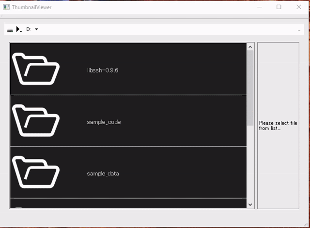

# thumbnail viewer

## Introduction

    This program generates thumbnails of video and stil images and displays them in a list.  
    Clicking on a listed content will display information about each content in the area to the right.  
    Video thumbnails are generated using Media Foundation functions.  
    Still image thumbnails are generated using QIcon in Qt.  

## Demo

## Verification OS

    Windows 10 Pro 21H2

## Build

    ex. VS2017 の場合  
    powershell.exe cmake -S . -B build -G "\"Visual Studio 15 2017 Win64\"" -DQTDIR="<Qtのパス>"  
    powershell.exe cmake --build build  

    ex. VS2019以上の場合  
    powershell.exe cmake -S . -B build -DQTDIR="<Qtのパス>"  
    powershell.exe cmake --build build  

    ex. Ninja + LLVMの場合(LLVM 16 win64で検証)  
    powershell.exe cmake -S . -B build -G "\"Ninja Multi-Config\"" -DQTDIR="<Qtのパス>"  
    powershell.exe cmake --build build --config debug

## Design

## Attension

    If a video file cannot be analyzed by MediaFoundation, it may not be possible to generate thumbnails.  
    We are currently confirming this with various videos.  

